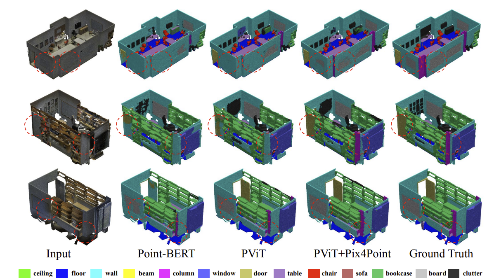

# Pix4Point
Webpage for paper `Image Pretrained Standard Transformers for 3D Point Cloud Understanding`

**Code is avaliable in https://github.com/guochengqian/PointNeXt, refer to [documentation](https://guochengqian.github.io/PointNeXt/projects/pix4point/) for training and testing details**

**Open an issue in https://github.com/guochengqian/PointNeXt if you have question regards to Pix4Point**. 

---
**Improving Standard Transformer Models for 3D Point Cloud Understanding with Image Pretraining**

### [arXiv](https://arxiv.org/abs/2208.12259) | [code](https://github.com/guochengqian/PointNeXt) | [doc](https://guochengqian.github.io/PointNeXt/projects/pix4point/)
*by [Guocheng Qian](https://www.gcqian.com/), [Xingdi Zhang](https://cindy-xdzhang.github.io/), [Abdullah Hamdi](https://github.com/ajhamdi), [Bernard Ghanem](https://www.bernardghanem.com/)*


**TL;DR:** We formulate a novel pipeline dubbed Pix4Point that allows harnessing pretrained Transformers in the image domain to improve downstream point cloud tasks. 


**Abstract**: 
While Standard Transformer (ST) models have achieved impressive success in natural language processing and computer vision, their performance on 3D point clouds is relatively poor. This is mainly due to the limitation of Transformers: a demanding need for large training data. Unfortunately, in the realm of 3D point clouds, the availability of large datasets is a challenge, which exacerbates the issue of training ST models for 3D tasks. In this work, we propose two contributions to improve ST models on point clouds. First, we contribute a new ST-based point cloud network, by using Progressive Point Patch Embedding as the tokenizer and Feature Propagation with global representation appending as the decoder. Our network is shown to be less hungry for data, and enables ST to achieve performance comparable to the state-of-the-art. Second, we formulate a simple yet effective pipeline dubbed \textit{Pix4Point}, which allows harnessing Transformers pretrained in the image domain to enhance downstream point cloud understanding. This is achieved through a modality-agnostic ST backbone with the help of our proposed tokenizer and decoder specialized in the 3D domain. Pretrained on a large number of widely available images, we observe significant gains of our ST model in the tasks of 3D point cloud classification, part segmentation, and semantic segmentation on ScanObjectNN, ShapeNetPart, and S3DIS benchmarks, respectively. Our code and models are available at [PointNeXt repo](https://github.com/guochengqian/pointnext). 

<p float="left">
  
  
</p>



# News
- :boom: Sep 2022, Code released in https://github.com/guochengqian/PointNeXt
-  :pushpin:  [Bernard Ghanem](https://www.bernardghanem.com/) is hiring visiting students. Monthly salary is paid with free housing. Contact Guocheng if interested: guocheng.qian@kaust.edu.sa


### Citation
If you are using our code in your work, please kindly cite the following:  
```
@misc{qian2022improving,
    title={Improving Standard Transformer Models for 3D Point Cloud Understanding with Image Pretraining},
    author={Guocheng Qian and Xingdi Zhang and Abdullah Hamdi and Bernard Ghanem},
    year={2022},
    eprint={2208.12259},
    archivePrefix={arXiv},
    primaryClass={cs.CV}
}
``` 

